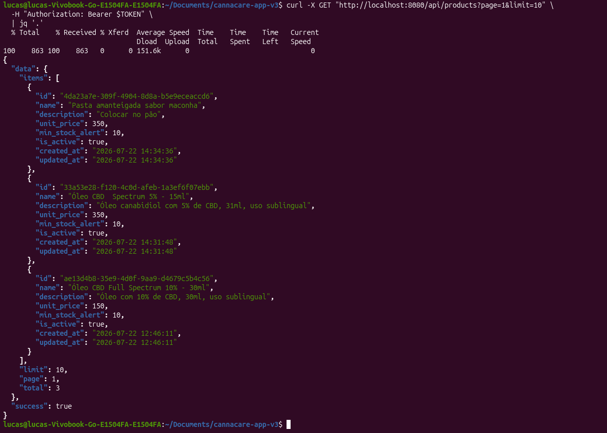
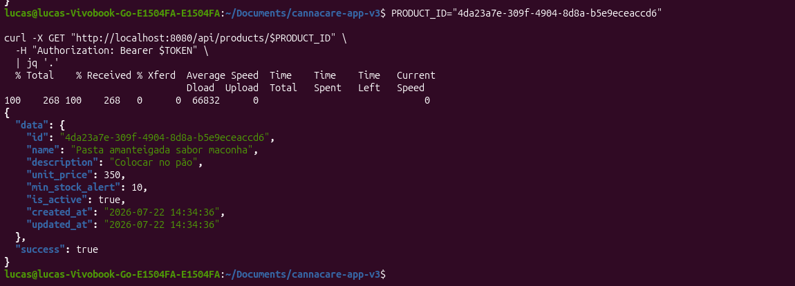
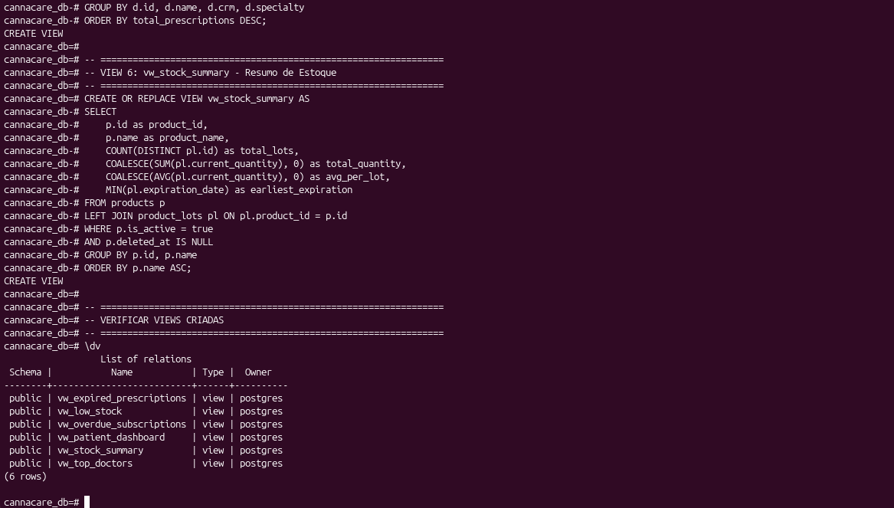
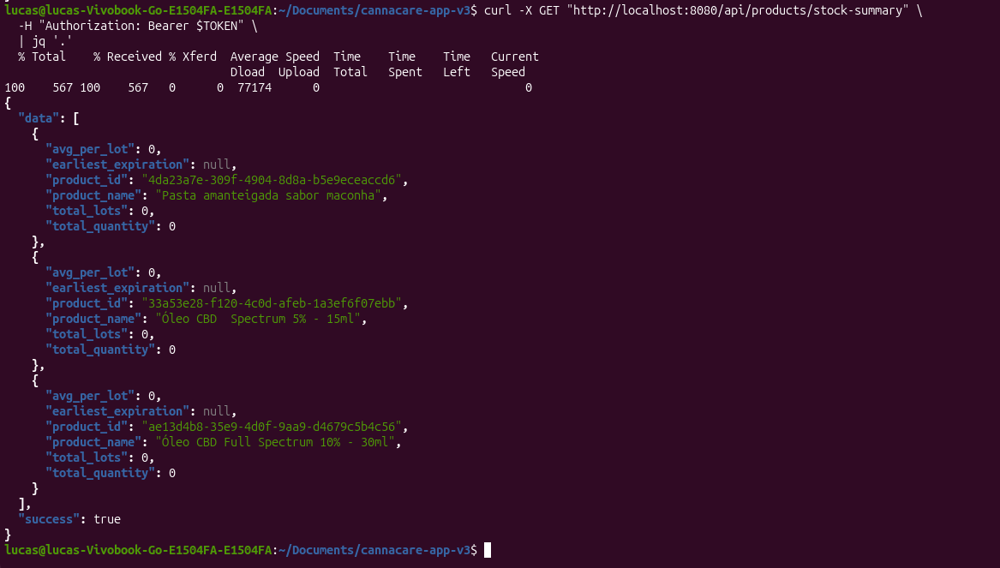

# cannacare-app-v3

## 🗺️ ROADMAP DETALHADO

| Etapa | Módulo | Duração Estimada | Status |
| :---: | :--- | :---: | :---: |
| 1 | Configuração Inicial (Banco + GORM) | 1 dia | ✅ Concluído |
| 2 | Models + Migrations (Todas as tabelas) | 2 dias | ⏳ Próximo |
| 3 | Autenticação (JWT + Login/Register) | 2 dias | ⏳ |
| 4 | CRUD de Médicos | 1 dia | ⏳ |
| 5 | CRUD de Pacientes | 2 dias | ⏳ |
| 6 | Upload de Documentos | 2 dias | ⏳ |
| 7 | Gestão de Receitas/Prescrições | 2 dias | ⏳ |
| 8 | Sistema de Acolhimento (Anamnese) | 2 dias | ⏳ |
| 9 | CRUD de Produtos | 1 dia | ⏳ |
| 10 | Controle de Estoque (Lotes + Movimentações) | 2 dias | ⏳ |
| 11 | Sistema de Pedidos (com baixa de estoque) | 2 dias | ⏳ |
| 12 | Financeiro (Anuidades + Pagamentos) | 2 dias | ⏳ |
| 13 | Dashboard + Relatórios (Views) | 2 dias | ⏳ |
| 14 | Middleware (Roles + Permissões) | 1 dia | ⏳ |
| 15 | Testes + Documentação Final | 2 dias | ⏳ |


 ## 📝 O QUE CADA ETAPA VAI ENTREGAR:

Etapa 1: ✅ CONFIGURAÇÃO INICIAL (Concluída)

    Estrutura de pastas

    Configuração do GORM

    Conexão com PostgreSQL

    Health check

```bash
# Branch principal (produção)
main

# Branches por etapa
git checkout -b etapa-01-configuracao-inicial
git checkout -b etapa-02-models-migrations
git checkout -b etapa-03-autenticacao
git checkout -b etapa-04-medicos
git checkout -b etapa-05-pacientes
git checkout -b etapa-06-documentos
git checkout -b etapa-07-prescricoes
git checkout -b etapa-08-anamnese
git checkout -b etapa-09-produtos
git checkout -b etapa-10-estoque
git checkout -b etapa-11-pedidos
git checkout -b etapa-12-financeiro
git checkout -b etapa-13-dashboard
git checkout -b etapa-14-middleware
git checkout -b etapa-15-testes

```
## 📁 ETAPA 9: CRUD DE PRODUTOS

Objetivo desta etapa:
    Nesta etapa será implementada o sistema de criação, leitura, atualização e eliminação de produtos canabis.
    Esta parte é fundamental para o catálogo de medicamentos que serão usados nas prescrições e pedidos.

📁 ESTRUTURA QUE VAMOS CRIAR

```bash
cannacare-app-v3/
├── internal/
│   ├── models/
│   │   └── product.go              # ✅ Já existe
│   ├── services/
│   │   ├── auth_service.go         # ✅ Já existe
│   │   ├── doctor_service.go       # ✅ Já existe
│   │   ├── patient_service.go      # ✅ Já existe
│   │   ├── document_service.go     # ✅ Já existe
│   │   ├── prescription_service.go # ✅ Já existe
│   │   ├── anamnese_service.go     # ✅ Já existe
│   │   └── product_service.go      # 🆕 Lógica para produtos
│   ├── handlers/
│   │   ├── auth_handler.go         # ✅ Já existe
│   │   ├── doctor_handler.go       # ✅ Já existe
│   │   ├── patient_handler.go      # ✅ Já existe
│   │   ├── document_handler.go     # ✅ Já existe
│   │   ├── prescription_handler.go # ✅ Já existe
│   │   ├── anamnese_handler.go     # ✅ Já existe
│   │   └── product_handler.go      # 🆕 Endpoints para produtos
│   ├── middleware/
│   │   └── auth.go                 # ✅ Já existe
│   └── utils/
│       ├── response.go             # ✅ Já existe
│       └── validators.go           # ✅ Já existe
├── pkg/
│   └── jwt/
│       └── jwt.go                  # ✅ Já existe
└── cmd/api/main.go                 # 🔄 Vamos atualizar

```

## ✅ TESTAR OS ENDPOINTS DE PRODUTOSx

1. Fazer login
```bash
TOKEN=$(curl -s -X POST http://localhost:8080/api/auth/login \
  -H "Content-Type: application/json" \
  -d '{"email":"admin@cannacare.com","password":"admin123"}' \
  | jq -r '.data.token')
``` 

2. Criar produto
```bash
curl -X POST http://localhost:8080/api/products   -H "Authorization: Bearer $TOKEN"   -H "Content-Type: application/json"   -d '{
    "name": "Óleo CBD  Spectrum 5% - 15ml",
    "description": "Óleo canabidiol com 5% de CBD, 31ml, uso sublingual",
    "unit_price": 350.00,
    "min_stock_alert": 10
  }' | jq '.'

``` 

3. Listar produtos
```bash
curl -X GET "http://localhost:8080/api/products?page=1&limit=10" \
  -H "Authorization: Bearer $TOKEN" \
  | jq '.'
``` 



4. Buscar produto por ID
```bash
PRODUCT_ID="4da23a7e-309f-4904-8d8a-b5e9eceaccd6"

curl -X GET "http://localhost:8080/api/products/$PRODUCT_ID" \
  -H "Authorization: Bearer $TOKEN" \
  | jq '.'
``` 



5. Atualizar produto
```bash
curl -X PUT "http://localhost:8080/api/products/$PRODUCT_ID" \
  -H "Authorization: Bearer $TOKEN" \
  -H "Content-Type: application/json" \
  -d '{
    "unit_price": 180.00,
    "min_stock_alert": 15
  }' | jq '.'
``` 
## Observação!
 Criar duas views importantes.
 - vw_low_stock
 - vw_stock_summary

```bash
-- ================================================================
-- VIEW: vw_low_stock - Produtos com Estoque Baixo
-- ================================================================
-- Mostra produtos com quantidade abaixo do mínimo definido
-- ================================================================
CREATE OR REPLACE VIEW vw_low_stock AS
SELECT 
    pl.id as lot_id,
    p.id as product_id,
    p.name as product_name,
    pl.lot_number,
    pl.expiration_date,
    pl.current_quantity,
    p.min_stock_alert,
    (p.min_stock_alert - pl.current_quantity) as missing_units
FROM product_lots pl
JOIN products p ON p.id = pl.product_id
WHERE pl.current_quantity <= p.min_stock_alert
AND pl.expiration_date > CURRENT_DATE
AND pl.deleted_at IS NULL
ORDER BY (p.min_stock_alert - pl.current_quantity) DESC;
``` 
```bash
-- ================================================================
-- VIEW: vw_stock_summary - Resumo de Estoque
-- ================================================================
-- Mostra um resumo geral do estoque por produto
-- ================================================================
CREATE OR REPLACE VIEW vw_stock_summary AS
SELECT 
    p.id as product_id,
    p.name as product_name,
    COUNT(DISTINCT pl.id) as total_lots,
    COALESCE(SUM(pl.current_quantity), 0) as total_quantity,
    COALESCE(AVG(pl.current_quantity), 0) as avg_per_lot,
    MIN(pl.expiration_date) as earliest_expiration
FROM products p
LEFT JOIN product_lots pl ON pl.product_id = p.id
WHERE p.is_active = true
AND p.deleted_at IS NULL
GROUP BY p.id, p.name
ORDER BY p.name ASC;
``` 
## ou pode criar todas as views de uma vez.
```bash
-- ================================================================
-- VIEW 1: vw_expired_prescriptions - Receitas Vencidas
-- ================================================================
CREATE OR REPLACE VIEW vw_expired_prescriptions AS
SELECT 
    p.id as patient_id,
    p.full_name,
    p.cpf,
    p.phone,
    pr.id as prescription_id,
    pr.expiration_date,
    pr.doctor_id,
    d.name as doctor_name,
    d.crm,
    EXTRACT(DAY FROM (CURRENT_DATE - pr.expiration_date)) as days_expired
FROM patients p
JOIN prescriptions pr ON pr.patient_id = p.id
JOIN doctors d ON d.id = pr.doctor_id
WHERE pr.expiration_date < CURRENT_DATE
AND pr.is_active = true
AND p.status = 'aprovado'
AND p.deleted_at IS NULL
ORDER BY pr.expiration_date ASC;

-- ================================================================
-- VIEW 2: vw_low_stock - Estoque Baixo
-- ================================================================
CREATE OR REPLACE VIEW vw_low_stock AS
SELECT 
    pl.id as lot_id,
    p.id as product_id,
    p.name as product_name,
    pl.lot_number,
    pl.expiration_date,
    pl.current_quantity,
    p.min_stock_alert,
    (p.min_stock_alert - pl.current_quantity) as missing_units
FROM product_lots pl
JOIN products p ON p.id = pl.product_id
WHERE pl.current_quantity <= p.min_stock_alert
AND pl.expiration_date > CURRENT_DATE
AND pl.deleted_at IS NULL
ORDER BY (p.min_stock_alert - pl.current_quantity) DESC;

-- ================================================================
-- VIEW 3: vw_overdue_subscriptions - Anuidades em Atraso
-- ================================================================
CREATE OR REPLACE VIEW vw_overdue_subscriptions AS
SELECT 
    s.id as subscription_id,
    p.id as patient_id,
    p.full_name,
    p.phone,
    s.due_date,
    s.amount,
    EXTRACT(DAY FROM (CURRENT_DATE - s.due_date)) as days_overdue
FROM subscriptions s
JOIN patients p ON p.id = s.patient_id
WHERE s.status = 'atrasado'
AND s.deleted_at IS NULL
ORDER BY s.due_date ASC;

-- ================================================================
-- VIEW 4: vw_patient_dashboard - Painel de Pacientes
-- ================================================================
CREATE OR REPLACE VIEW vw_patient_dashboard AS
SELECT 
    status,
    COUNT(*) as total,
    COUNT(CASE WHEN is_social_patient = true THEN 1 END) as social_patients,
    COUNT(CASE WHEN created_at >= CURRENT_DATE - INTERVAL '30 days' THEN 1 END) as last_30_days
FROM patients
WHERE deleted_at IS NULL
GROUP BY status;

-- ================================================================
-- VIEW 5: vw_top_doctors - Médicos que mais prescrevem
-- ================================================================
CREATE OR REPLACE VIEW vw_top_doctors AS
SELECT 
    d.id as doctor_id,
    d.name as doctor_name,
    d.crm,
    d.specialty,
    COUNT(pr.id) as total_prescriptions,
    COUNT(DISTINCT pr.patient_id) as unique_patients
FROM doctors d
LEFT JOIN prescriptions pr ON pr.doctor_id = d.id
WHERE d.is_active = true
AND d.deleted_at IS NULL
GROUP BY d.id, d.name, d.crm, d.specialty
ORDER BY total_prescriptions DESC;

-- ================================================================
-- VIEW 6: vw_stock_summary - Resumo de Estoque
-- ================================================================
CREATE OR REPLACE VIEW vw_stock_summary AS
SELECT 
    p.id as product_id,
    p.name as product_name,
    COUNT(DISTINCT pl.id) as total_lots,
    COALESCE(SUM(pl.current_quantity), 0) as total_quantity,
    COALESCE(AVG(pl.current_quantity), 0) as avg_per_lot,
    MIN(pl.expiration_date) as earliest_expiration
FROM products p
LEFT JOIN product_lots pl ON pl.product_id = p.id
WHERE p.is_active = true
AND p.deleted_at IS NULL
GROUP BY p.id, p.name
ORDER BY p.name ASC;

-- ================================================================
-- VERIFICAR VIEWS CRIADAS
-- ================================================================
\dv

```



6. Produtos com estoque baixo
```bash
curl -X GET "http://localhost:8080/api/products/low-stock" \
  -H "Authorization: Bearer $TOKEN" \
  | jq '.'
``` 


7. Resumo de estoque
```bash
curl -X GET "http://localhost:8080/api/products/stock-summary" \
  -H "Authorization: Bearer $TOKEN" \
  | jq '.'
``` 



