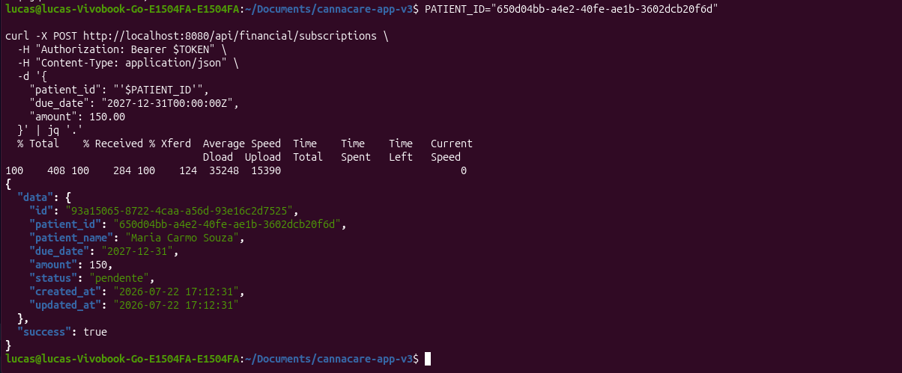

# cannacare-app-v3

## 🗺️ ROADMAP DETALHADO

| Etapa | Módulo | Duração Estimada | Status |
| :---: | :--- | :---: | :---: |
| 1 | Configuração Inicial (Banco + GORM) | 1 dia | ✅ Concluído |
| 2 | Models + Migrations (Todas as tabelas) | 2 dias | ⏳ Próximo |
| 3 | Autenticação (JWT + Login/Register) | 2 dias | ⏳ |
| 4 | CRUD de Médicos | 1 dia | ⏳ |
| 5 | CRUD de Pacientes | 2 dias | ⏳ |
| 6 | Upload de Documentos | 2 dias | ⏳ |
| 7 | Gestão de Receitas/Prescrições | 2 dias | ⏳ |
| 8 | Sistema de Acolhimento (Anamnese) | 2 dias | ⏳ |
| 9 | CRUD de Produtos | 1 dia | ⏳ |
| 10 | Controle de Estoque (Lotes + Movimentações) | 2 dias | ⏳ |
| 11 | Sistema de Pedidos (com baixa de estoque) | 2 dias | ⏳ |
| 12 | Financeiro (Anuidades + Pagamentos) | 2 dias | ⏳ |
| 13 | Dashboard + Relatórios (Views) | 2 dias | ⏳ |
| 14 | Middleware (Roles + Permissões) | 1 dia | ⏳ |
| 15 | Testes + Documentação Final | 2 dias | ⏳ |


 ## 📝 O QUE CADA ETAPA VAI ENTREGAR:

Etapa 1: ✅ CONFIGURAÇÃO INICIAL (Concluída)

    Estrutura de pastas

    Configuração do GORM

    Conexão com PostgreSQL

    Health check

```bash
# Branch principal (produção)
main

# Branches por etapa
git checkout -b etapa-01-configuracao-inicial
git checkout -b etapa-02-models-migrations
git checkout -b etapa-03-autenticacao
git checkout -b etapa-04-medicos
git checkout -b etapa-05-pacientes
git checkout -b etapa-06-documentos
git checkout -b etapa-07-prescricoes
git checkout -b etapa-08-anamnese
git checkout -b etapa-09-produtos
git checkout -b etapa-10-estoque
git checkout -b etapa-11-pedidos
git checkout -b etapa-12-financeiro
git checkout -b etapa-13-dashboard
git checkout -b etapa-14-middleware
git checkout -b etapa-15-testes

```
## 📁 ETAPA 12: Sistema Financeiro(Anuidades e pagamentos)

Objetivo desta etapa:
    Nesta etapa será implementada o sistema financeiro completo, incluíndo anuídade e pagamentos. Esta parte do projeto é importante para a sustentabilidade da associação.

📁 ESTRUTURA QUE VAMOS CRIAR

```bash
cannacare-app-v3/
├── internal/
│   ├── models/
│   │   ├── subscription.go          # ✅ Já existe
│   │   └── payment.go               # ✅ Já existe
│   ├── services/
│   │   ├── ... (todos os services existentes)
│   │   └── financial_service.go     # 🆕 Lógica para financeiro
│   ├── handlers/
│   │   ├── ... (todos os handlers existentes)
│   │   └── financial_handler.go     # 🆕 Endpoints para financeiro
│   ├── middleware/
│   │   └── auth.go                  # ✅ Já existe
│   └── utils/
│       ├── response.go              # ✅ Já existe
│       └── validators.go            # ✅ Já existe
├── pkg/
│   └── jwt/
│       └── jwt.go                   # ✅ Já existe
└── cmd/api/main.go                  # 🔄 Vamos atualizar
```

## ✅ TESTAR OS ENDPOINTS FINANCEIROS

Fazer login

```bash
TOKEN=$(curl -s -X POST http://localhost:8080/api/auth/login \
  -H "Content-Type: application/json" \
  -d '{"email":"admin@cannacare.com","password":"admin123"}' \
  | jq -r '.data.token')

``` 
1. Criar anuidade
```bash

PATIENT_ID="650d04bb-a4e2-40fe-ae1b-3602dcb20f6d"
curl -X POST http://localhost:8080/api/financial/subscriptions \
  -H "Authorization: Bearer $TOKEN" \
  -H "Content-Type: application/json" \
  -d '{
    "patient_id": "'$PATIENT_ID'",
    "due_date": "2027-12-31T00:00:00Z",
    "amount": 150.00
  }' | jq '.'

``` 



2. Listar anuidades
```bash

curl -X GET "http://localhost:8080/api/financial/subscriptions" \
  -H "Authorization: Bearer $TOKEN" \
  | jq '.'

``` 

3. Registrar pagamento (anuidade)
```bash

SUBSCRIPTION_ID="93a15065-8722-4caa-a56d-93e16c2d7525"

curl -X POST http://localhost:8080/api/financial/payments \
  -H "Authorization: Bearer $TOKEN" \
  -H "Content-Type: application/json" \
  -d '{
    "patient_id": "'$PATIENT_ID'",
    "subscription_id": "'$SUBSCRIPTION_ID'",
    "payment_type": "anuidade",
    "payment_method": "pix",
    "amount": 150.00,
    "installments": 1
  }' | jq '.'


``` 

4. Listar pagamentos
```bash
curl -X GET "http://localhost:8080/api/financial/payments" \
  -H "Authorization: Bearer $TOKEN" \
  | jq '.'


``` 

5. Atualizar status do pagamento
```bash

PAYMENT_ID="id-do-pagamento"

curl -X PATCH "http://localhost:8080/api/financial/payments/$PAYMENT_ID/status" \
  -H "Authorization: Bearer $TOKEN" \
  -H "Content-Type: application/json" \
  -d '{"status": "pago"}' | jq '.'


``` 
6. Status financeiro do paciente
```bash

curl -X GET "http://localhost:8080/api/financial/patient/$PATIENT_ID" \
  -H "Authorization: Bearer $TOKEN" \
  | jq '.'

``` 
7. Anuidades em atraso
```bash

curl -X GET "http://localhost:8080/api/financial/overdue" \
  -H "Authorization: Bearer $TOKEN" \
  | jq '.'


``` 


