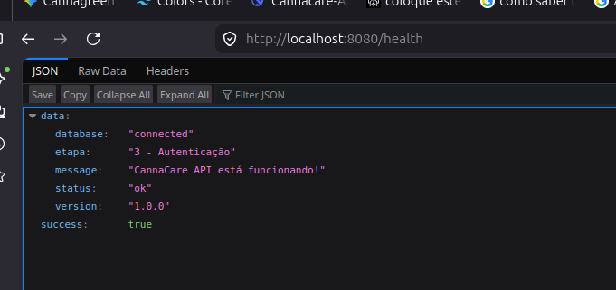
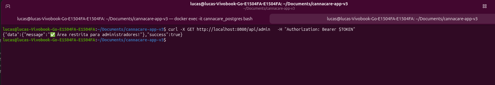

# cannacare-app-v3

## 🗺️ ROADMAP DETALHADO

| Etapa | Módulo | Duração Estimada | Status |
| :---: | :--- | :---: | :---: |
| 1 | Configuração Inicial (Banco + GORM) | 1 dia | ✅ Concluído |
| 2 | Models + Migrations (Todas as tabelas) | 2 dias | ⏳ Próximo |
| 3 | Autenticação (JWT + Login/Register) | 2 dias | ⏳ |
| 4 | CRUD de Médicos | 1 dia | ⏳ |
| 5 | CRUD de Pacientes | 2 dias | ⏳ |
| 6 | Upload de Documentos | 2 dias | ⏳ |
| 7 | Gestão de Receitas/Prescrições | 2 dias | ⏳ |
| 8 | Sistema de Acolhimento (Anamnese) | 2 dias | ⏳ |
| 9 | CRUD de Produtos | 1 dia | ⏳ |
| 10 | Controle de Estoque (Lotes + Movimentações) | 2 dias | ⏳ |
| 11 | Sistema de Pedidos (com baixa de estoque) | 2 dias | ⏳ |
| 12 | Financeiro (Anuidades + Pagamentos) | 2 dias | ⏳ |
| 13 | Dashboard + Relatórios (Views) | 2 dias | ⏳ |
| 14 | Middleware (Roles + Permissões) | 1 dia | ⏳ |
| 15 | Testes + Documentação Final | 2 dias | ⏳ |


 ## 📝 O QUE CADA ETAPA VAI ENTREGAR:

Etapa 1: ✅ CONFIGURAÇÃO INICIAL (Concluída)

    Estrutura de pastas

    Configuração do GORM

    Conexão com PostgreSQL

    Health check

```bash
# Branch principal (produção)
main

# Branches por etapa
git checkout -b etapa-01-configuracao-inicial
git checkout -b etapa-02-models-migrations
git checkout -b etapa-03-autenticacao
git checkout -b etapa-04-medicos
git checkout -b etapa-05-pacientes
git checkout -b etapa-06-documentos
git checkout -b etapa-07-prescricoes
git checkout -b etapa-08-anamnese
git checkout -b etapa-09-produtos
git checkout -b etapa-10-estoque
git checkout -b etapa-11-pedidos
git checkout -b etapa-12-financeiro
git checkout -b etapa-13-dashboard
git checkout -b etapa-14-middleware
git checkout -b etapa-15-testes

```
## 📁 ETAPA 3: Autenticação e JWT

Objetivo desta etapa:

    Mapeamento das tabelas em GO e rodar Migrations para criar as tabelas no PostgreSQO

```bash
cannacare-backend/
├── internal/
│   ├── models/
│   │   └── user.go              # ✅ Já existe
│   ├── config/
│   │   └── config.go            # ✅ Já existe (vamos adicionar JWT config)
│   ├── database/
│   │   └── db.go                # ✅ Já existe
│   ├── services/
│   │   └── auth_service.go      # 🆕 Lógica de autenticação
│   ├── handlers/
│   │   └── auth_handler.go      # 🆕 Endpoints HTTP
│   ├── middleware/
│   │   └── auth.go              # 🆕 Middleware de autenticação
│   └── utils/
│       └── response.go          # 🆕 Respostas padronizadas
├── pkg/
│   └── jwt/
│       └── jwt.go               # 🆕 Gerar/validar JWT
└── cmd/api/main.go              # ✅ Já existe (vamos atualizar)

```

## 📦 INSTALAR NOVAS DEPENDÊNCIAS

```bash
# JWT para autenticação
go get -u github.com/golang-jwt/jwt/v5

# Bcrypt para hash de senhas
go get -u golang.org/x/crypto/bcrypt

# Validação de dados
go get -u github.com/go-playground/validator/v10
``` 

## 🚀 TESTAR A API

Abra um terminal e execute o comando para cada endpoint

1. Health Check
- ```curl http://localhost:8080/health```

## Resposta: 



## 2. Registrar um usuário
```bash 
curl -X POST http://localhost:8080/api/auth/register \
  -H "Content-Type: application/json" \
  -d '{
    "name": "Administrador",
    "email": "admin@cannacare.com",
    "password": "admin123",
    "role": "admin"
  }'
  ```

## Resposta:


## 3. Fazer login
```bash
curl -X POST http://localhost:8080/api/auth/login \
  -H "Content-Type: application/json" \
  -d '{
    "email": "admin@cannacare.com",
    "password": "admin123"
  }'

```
## Resposta:


## 4. Acessar rota protegida

 Pegue o token do login e substitua
``` bash
TOKEN="seu-token-aqui"
curl -X GET http://localhost:8080/api/protected \
  -H "Authorization: Bearer $TOKEN"
``` 

  Resposta: 
  

  ## 5. Acessar rota Admin
  ```bash
  curl -X GET http://localhost:8080/api/admin \
  -H "Authorization: Bearer $TOKEN"

  ``` 
## Resposta
  