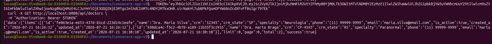
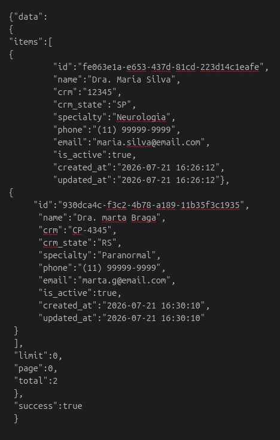
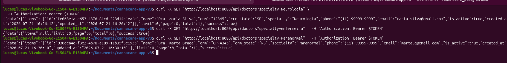
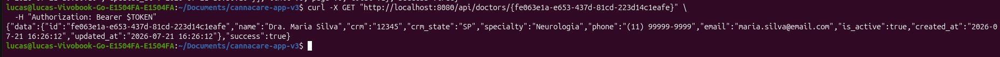
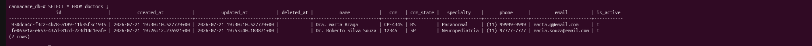
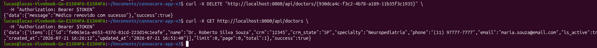
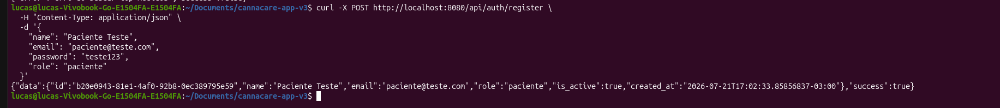
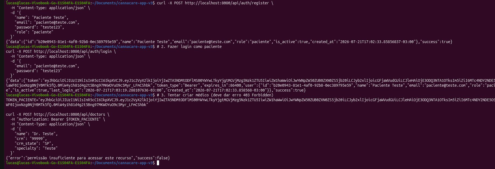

# cannacare-app-v3

## 🗺️ ROADMAP DETALHADO

| Etapa | Módulo | Duração Estimada | Status |
| :---: | :--- | :---: | :---: |
| 1 | Configuração Inicial (Banco + GORM) | 1 dia | ✅ Concluído |
| 2 | Models + Migrations (Todas as tabelas) | 2 dias | ⏳ Próximo |
| 3 | Autenticação (JWT + Login/Register) | 2 dias | ⏳ |
| 4 | CRUD de Médicos | 1 dia | ⏳ |
| 5 | CRUD de Pacientes | 2 dias | ⏳ |
| 6 | Upload de Documentos | 2 dias | ⏳ |
| 7 | Gestão de Receitas/Prescrições | 2 dias | ⏳ |
| 8 | Sistema de Acolhimento (Anamnese) | 2 dias | ⏳ |
| 9 | CRUD de Produtos | 1 dia | ⏳ |
| 10 | Controle de Estoque (Lotes + Movimentações) | 2 dias | ⏳ |
| 11 | Sistema de Pedidos (com baixa de estoque) | 2 dias | ⏳ |
| 12 | Financeiro (Anuidades + Pagamentos) | 2 dias | ⏳ |
| 13 | Dashboard + Relatórios (Views) | 2 dias | ⏳ |
| 14 | Middleware (Roles + Permissões) | 1 dia | ⏳ |
| 15 | Testes + Documentação Final | 2 dias | ⏳ |


 ## 📝 O QUE CADA ETAPA VAI ENTREGAR:

Etapa 1: ✅ CONFIGURAÇÃO INICIAL (Concluída)

    Estrutura de pastas

    Configuração do GORM

    Conexão com PostgreSQL

    Health check

```bash
# Branch principal (produção)
main

# Branches por etapa
git checkout -b etapa-01-configuracao-inicial
git checkout -b etapa-02-models-migrations
git checkout -b etapa-03-autenticacao
git checkout -b etapa-04-medicos
git checkout -b etapa-05-pacientes
git checkout -b etapa-06-documentos
git checkout -b etapa-07-prescricoes
git checkout -b etapa-08-anamnese
git checkout -b etapa-09-produtos
git checkout -b etapa-10-estoque
git checkout -b etapa-11-pedidos
git checkout -b etapa-12-financeiro
git checkout -b etapa-13-dashboard
git checkout -b etapa-14-middleware
git checkout -b etapa-15-testes

```
## 📁 ETAPA 4: CRUD de médicos

Objetivo desta etapa:

   nesta etapa vamos focar em criar as API's para criar, ler, atualizar e deletar registros de médicos.

- CRUD completo de médicos (Create, Read, Update, Delete)

- Endpoints para listar médicos

- Buscar médico por ID

- Atualizar dados do médico

- Desativar médico (soft delete)

- Listar médicos com filtros (por especialidade, CRM, etc)

```bash
cannacare-app-v3/
├── internal/
│   ├── models/
│   │   └── doctor.go              # ✅ Já existe
│   ├── services/
│   │   ├── auth_service.go        # ✅ Já existe
│   │   └── doctor_service.go      # 🆕 Lógica de negócio para médicos
│   ├── handlers/
│   │   ├── auth_handler.go        # ✅ Já existe
│   │   └── doctor_handler.go      # 🆕 Endpoints HTTP para médicos
│   ├── middleware/
│   │   └── auth.go                # ✅ Já existe
│   └── utils/
│       └── response.go            # ✅ Já existe
├── pkg/
│   └── jwt/
│       └── jwt.go                 # ✅ Já existe
└── cmd/api/main.go                # 🔄 Vamos atualizar
``` 

## 🧪 TESTES DA ETAPA 4 - CRUD DE MÉDICOS

PRÉ-REQUISITO: OBTER TOKEN DE AUTENTICAÇÃO

Antes de testar os endpoints de médicos, você precisa estar autenticado:

```bash
# 1. Registrar um usuário admin (se ainda não fez)
curl -X POST http://localhost:8080/api/auth/register \
  -H "Content-Type: application/json" \
  -d '{
    "name": "Administrador",
    "email": "admin@cannacare.com",
    "password": "admin123",
    "role": "admin"
  }'

# 2. Fazer login e obter o token
curl -X POST http://localhost:8080/api/auth/login \
  -H "Content-Type: application/json" \
  -d '{
    "email": "admin@cannacare.com",
    "password": "admin123"
  }'
```

## Resposta do login:

```bash

{
  "success": true,
  "data": {
    "token": "eyJhbGciOiJIUzI1NiIsInR5cCI6IkpXVCJ9...",
    "token_type": "Bearer",
    "expires_in": 86400,
    "user": {
      "id": "uuid",
      "name": "Administrador",
      "email": "admin@cannacare.com",
      "role": "admin"
    }
  }
}
```
## GUARDE O TOKEN! Você vai usar em todas as requisições:

```bash
# Defina a variável TOKEN (substitua pelo token real)
TOKEN="eyJhbGciOiJIUzI1NiIsInR5cCI6IkpXVCJ9.eyJ1c2VyX2lkIjoi..."
```
## TESTE 1: CRIAR UM MÉDICO.

``` bash
curl -X POST http://localhost:8080/api/doctors \
  -H "Authorization: Bearer $TOKEN" \
  -H "Content-Type: application/json" \
  -d '{
    "name": "Dra. Maria Silva",
    "crm": "12345",
    "crm_state": "SP",
    "specialty": "Neurologia",
    "phone": "(11) 99999-9999",
    "email": "maria.silva@email.com"
  }'
```
## Resposta.


## TESTE 2: CRIAR MAIS MÉDICOS.
 ```bash
# Médico 2
TOKEN="substitue o token aqui"
curl -X POST http://localhost:8080/api/doctors \
  -H "Authorization: Bearer $TOKEN" \
  -H "Content-Type: application/json" \
  -d '{
    "name": "Dr. João Santos",
    "crm": "67890",
    "crm_state": "RJ",
    "specialty": "Psiquiatria",
    "phone": "(21) 88888-8888",
    "email": "joao.santos@email.com"
  }'

# Médico 3

TOKEN="substitue o token aqui"
curl -X POST http://localhost:8080/api/doctors \
  -H "Authorization: Bearer $TOKEN" \
  -H "Content-Type: application/json" \
  -d '{
    "name": "Dra. Ana Oliveira",
    "crm": "11111",
    "crm_state": "MG",
    "specialty": "Neurologia",
    "phone": "(31) 77777-7777",
    "email": "ana.oliveira@email.com"
  }'

 ``` 

 ## TESTE 3: LISTAR TODOS OS MÉDICOS.
 ``` bash
 curl -X GET http://localhost:8080/api/doctors \
  -H "Authorization: Bearer $TOKEN"
 ```

 ## Resposta.

 
 ___
 

 ## TESTE 4: LISTAR COM FILTROS.
 Filtrar por especialidade:

 ```bash
curl -X GET "http://localhost:8080/api/doctors?specialty=Neurologia" \
  -H "Authorization: Bearer $TOKEN"
 ```
 

 ## Filtrar por nome:
 ``` bash
curl -X GET "http://localhost:8080/api/doctors?name=Maria" \
  -H "Authorization: Bearer $TOKEN"
 ```
 ## Resposta.
 

## Filtrar por CRM:

``` bash
curl -X GET "http://localhost:8080/api/doctors?crm=12345" \
  -H "Authorization: Bearer $TOKEN"
``` 

## Resposta.


## Filtrar por status (apenas ativos/inativos):
```bash
# Apenas ativos
curl -X GET "http://localhost:8080/api/doctors?is_active=true" \
  -H "Authorization: Bearer $TOKEN"

# Apenas inativos
curl -X GET "http://localhost:8080/api/doctors?is_active=false" \
  -H "Authorization: Bearer $TOKEN"
``` 

## Com paginação:
``` bash
curl -X GET "http://localhost:8080/api/doctors?page=1&limit=2" \
  -H "Authorization: Bearer $TOKEN"
```

## TESTE 5: BUSCAR MÉDICO POR ID.
Primeiro, pegue o ID de um médico da listagem:
```bash
# Substitua {id} pelo UUID real do médico
curl -X GET "http://localhost:8080/api/doctors/{id}" \
  -H "Authorization: Bearer $TOKEN"
``` 
## Resposta:



## TESTE 6: ATUALIZAR MÉDICO.
```bash
# Substitua {id} pelo UUID real
curl -X PUT "http://localhost:8080/api/doctors/{id}" \
  -H "Authorization: Bearer $TOKEN" \
  -H "Content-Type: application/json" \
  -d '{
    "specialty": "Neuropediatria",
    "phone": "(11) 98888-8888"
  }'

```

## Atualizar todos os campos:
```bash
curl -X PUT "http://localhost:8080/api/doctors/{id}" \
  -H "Authorization: Bearer $TOKEN" \
  -H "Content-Type: application/json" \
  -d '{
    "name": "Dr. Roberto Silva Souza",
    "specialty": "Neuropediatria",
    "phone": "(11) 97777-7777",
    "email": "maria.souza@email.com",
    "is_active": true
  }'
``` 



## TESTE 7: DESATIVAR MÉDICO.
```bash
# Substitua {id} pelo UUID real
curl -X PUT "http://localhost:8080/api/doctors/{id}" \
  -H "Authorization: Bearer $TOKEN" \
  -H "Content-Type: application/json" \
  -d '{
    "is_active": false
  }'
``` 

## TESTE 8: DELETAR MÉDICO (SOFT DELETE).
```bash
# Substitua {id} pelo UUID real
curl -X DELETE "http://localhost:8080/api/doctors/{id}" \
  -H "Authorization: Bearer $TOKEN"
```
## Verificar se o médico foi removido (não deve aparecer na listagem):
```bash
curl -X GET http://localhost:8080/api/doctors \
  -H "Authorization: Bearer $TOKEN"
```
## Resposta.


## TESTE 9: MÉDICOS QUE MAIS PRESCREVEM.
``` bash
curl -X GET http://localhost:8080/api/doctors/top \
  -H "Authorization: Bearer $TOKEN"
``` 

## Resposta.
Resposta esperada (inicialmente vazia - sem prescrições):
```bash
{
  "success": true,
  "data": []
}
``` 
## TESTE 10: TESTAR PERMISSÕES.
Tentar criar médico com usuário comum (sem permissão)
``` bash
# 1. Registrar um usuário comum (paciente)
curl -X POST http://localhost:8080/api/auth/register \
  -H "Content-Type: application/json" \
  -d '{
    "name": "Paciente Teste",
    "email": "paciente@teste.com",
    "password": "teste123",
    "role": "paciente"
  }'

# 2. Fazer login como paciente
curl -X POST http://localhost:8080/api/auth/login \
  -H "Content-Type: application/json" \
  -d '{
    "email": "paciente@teste.com",
    "password": "teste123"
  }'

# 3. Tentar criar médico (deve dar erro 403 Forbidden)
TOKEN_PACIENTE="token-do-paciente"

curl -X POST http://localhost:8080/api/doctors \
  -H "Authorization: Bearer $TOKEN_PACIENTE" \
  -H "Content-Type: application/json" \
  -d '{
    "name": "Dr. Teste",
    "crm": "99999",
    "crm_state": "SP",
    "specialty": "Teste"
  }'
``` 
## Resposta.




## Resumo.


| Teste | Endpoint | Método | Status |
| :---: | :--- | :---: | :---: |
| 1 | `/api/doctors` | POST | ✅ |
| 2 | `/api/doctors` | POST (vários) | ✅ |
| 3 | `/api/doctors` | GET | ✅ |
| 4 | `/api/doctors?filtros` | GET | ✅ |
| 5 | `/api/doctors/{id}` | GET | ✅ |
| 6 | `/api/doctors/{id}` | PUT | ✅ |
| 7 | `/api/doctors/{id}` | PUT (desativar) | ✅ |
| 8 | `/api/doctors/{id}` | DELETE | ✅ |
| 9 | `/api/doctors/top` | GET | ✅ |
| 10 | Teste de permissão | - | ✅ |


| Erro | Causa | Solução |
| :--- | :--- | :--- |
| **401 Unauthorized** | Token inválido ou expirado | Fazer login novamente |
| **403 Forbidden** | Usuário sem permissão | Usar role admin/secretaria |
| **400 Bad Request** | Dados inválidos | Verificar formato dos dados |
| **404 Not Found** | ID não existe | Verificar UUID correto |
